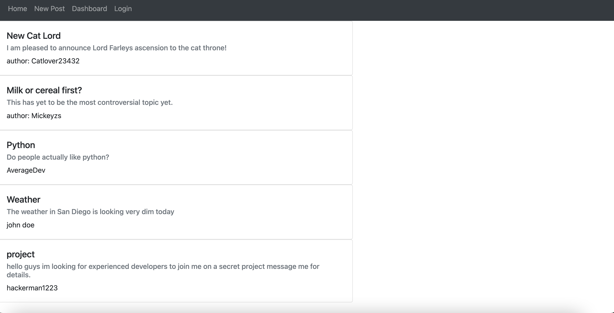

   <h1 align ="center">Blog App<h1>


## Description
The task was to create a blog app in which users can post articles and comment on each others post only after they have signed in.
# Table of Contents
* [Description](#description)
* [Technologies](#technologies)
* [Installation](#installation)
* [License](#license)
* [Contributions](#contributions)
* [Github](#github)


[deploy-link](https://coolprojectt.herokuapp.com)
## Technologies

<li>Node</li>
<li>MySQL</li>
<li>JS</li>

## Bugs
<li>Handlebars isn't being used efficiently.</li>
<li>The user is not being able to sign in.</li>
<li>The user is not being able to sign out.</li>


## Installation
clone the repository into your local machine after do the following:

```bash
npm init -y
npm install
mysql -u root -p
```
<strong> DONT FORGET TO SOURCE THE DB db/schema.sql </strong>
## License

<br>
This Project is licensed under the MIT license.

## Contributions


## Github
Questions? 
Contact me through my github Yahir-F

Email: placeholder@gmail.com


    